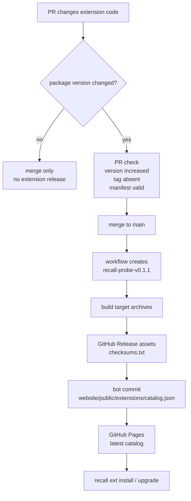
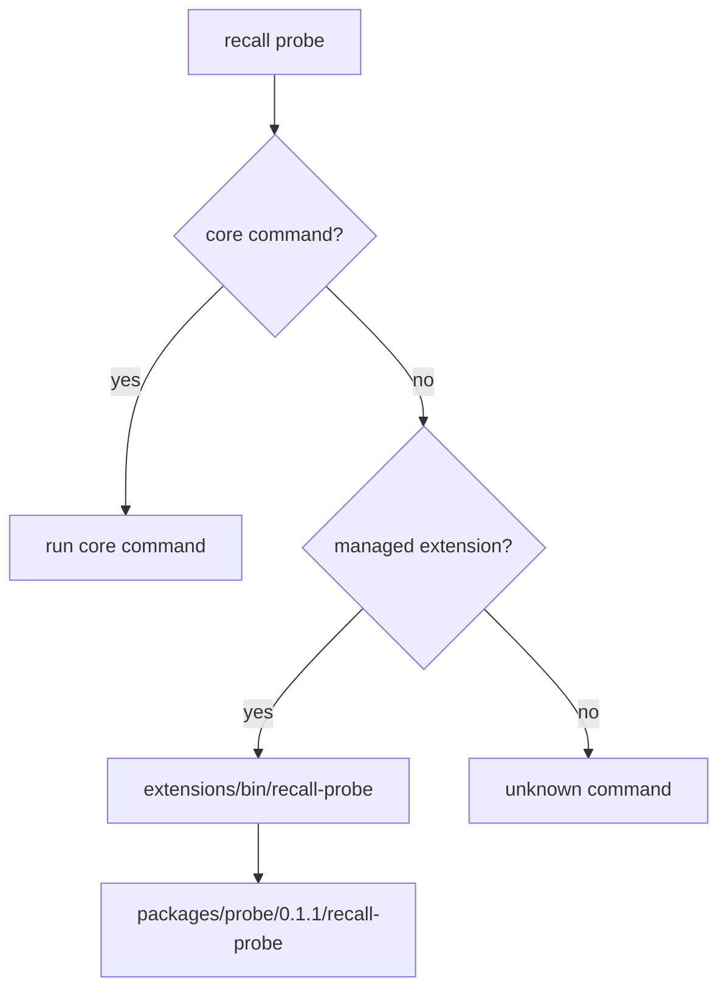

# Recall Extensions Design

Status: long-lived design draft. Feature migration notes live in
`docs/extension-migrations.md`.

## Goal

Keep Recall core small and stable: a local session index plus a stable query
surface. As product features grow, workflow, report, publish, and UI surfaces
should evolve as optional, independently shippable official extensions.
Third-party distribution is a future option, not part of the first managed
surface.

## Problem

Recall's core data flow is:

```text
source adapters -> sync -> SQLite -> search -> CLI/TUI
```

Feature pressure will keep building around that core: sharing, reflection,
dashboards, search UIs, token/scale analytics, and agent-facing workflows. Each
feature can be reasonable on its own, but merging all of them into core grows
the binary, CLI surface, TUI surface, and test matrix.

Without an explicit boundary, core bloats one reasonable feature at a time.

## Decision

1. Core is the data plane plus a stable query protocol.
2. Extensions are external executables that consume that protocol.
3. The extension model is Cargo/Git-style external subcommands.
4. Managed extension binaries are named `recall-<name>`; `recall <name>`
   dispatches to installed official extensions.
5. The stable contract is CLI JSON/JSONL output, not Rust API and not SQLite
   schema.
6. Reject Rust dylib plugins, in-process plugin API, and a WASM runtime for now.
   Revisit WASM only if running untrusted third-party code becomes a real
   requirement.

## Boundary

The criterion is not "read-only". The sharper boundary is:

- Capabilities that write the Recall index, data plane, or schema migrations
  belong in core.
- Capabilities that do not mutate the Recall index/data plane/schema and only
  consume the stable query protocol are extension candidates.
- Extensions may write their own local artifacts, config, or external provider
  resources after explicit user action, but they should not write the Recall
  SQLite index directly.

Core owns:

- source adapters, sync, import, storage, and schema migrations;
- full-text search and semantic search;
- session identity and repo/project resolution;
- minimal session operations: list, show, export, resume, open;
- machine-readable output for those operations: `--format json|jsonl`;
- the extension host: official catalog discovery, managed install, dispatch,
  list, remove, and upgrade;
- bundled Agent Skill install.

Extensions own:

- workflow, report, and calibration products;
- provider-specific publishing;
- web UI dashboards and search surfaces;
- token/scale analytics views beyond the built-in usage report;
- agent-facing discussion, proposal, and calibration loops.

Usage tracking stays in core. Token events are data-plane records written by
source adapters during sync.

Skills and extensions are different:

- bundled skills (`recall skill install`) are agent-facing prompt bundles;
- extensions are executables;
- one feature can ship both a skill and an extension.

## Why External Subcommands

Rust CLI extension options:

| Approach | Verdict |
| --- | --- |
| External subcommand binaries (`cargo-*`, `git-*`, `gh` extensions) | Chosen. No ABI risk, language-agnostic, and proven in long-lived tools. Cargo also recommends integrating through the CLI instead of linking Cargo as a library. |
| Long-lived protocol subprocesses (Nushell plugins, Terraform providers) | Worth it only when plugins join the host's inner loop. Recall extensions are command-shaped for now. |
| WASM sandbox (Zellij, Extism) | Solves untrusted-code execution. Recall's current problem is product boundary and optional feature distribution, not sandboxing. |
| Rust dylib (`libloading`, `abi_stable`) | Rust has no stable ABI. `unsafe extern "C"` boundaries and per-platform symbol issues are permanent maintenance debt. |
| Cargo features | Compile-time trimming, not user-installable extensions. Orthogonal to this model. |

References:
[Cargo external tools](https://doc.rust-lang.org/cargo/reference/external-tools.html),
[gh extensions](https://cli.github.com/manual/gh_extension),
[Extism plug-in system](https://extism.org/docs/concepts/plug-in-system/),
[Rust linkage](https://doc.rust-lang.org/reference/linkage.html),
[libloading](https://docs.rs/libloading/latest/libloading/).

## Protocol Contract

Extensions consume Recall through the CLI:

```bash
recall info --format json
recall session list --project /repo --format json
recall session list --query "query" --project /repo --format json
recall search "query" --project /repo --format json
recall session show --id <id> --format json --include metadata,messages,usage,events
recall export --project /repo
```

Current core support:

- `recall info --format json` exposes `protocol_version`, database schema
  version, and export record schema version;
- `recall session list` supports `--format json|jsonl`;
- `recall search --format json` is a thin wrapper over the same JSON shape as
  `recall session list --query ... --format json`;
- `recall session show` supports `--format json|jsonl`;
- `recall export` emits JSONL, one session record per line, with export record
  schema version 4;
- `recall session show --format json` defaults to metadata only. Extensions
  that need transcript data must pass `--messages` or
  `--include metadata,messages,usage,events`.

### Stability Rules

Stable protocol means machine output on stdout:

- stdout contains only the requested JSON/JSONL data;
- progress, warnings, sync status, and deploy status go to stderr;
- JSON objects may add fields;
- published fields must not be silently removed, renamed, or changed in meaning;
- breaking changes must bump `protocol_version`;
- each JSONL line must be one complete JSON object;
- pretty formatting is not the stable contract, field semantics are;
- non-zero exit code means failure.

Error output remains human-readable stderr until an extension needs structured
error handling. When that happens, add a machine-readable error envelope instead
of letting each command invent its own shape:

```json
{
  "error": {
    "code": "session_not_found",
    "message": "session not found: <id>"
  }
}
```

### Explicitly Unstable

- SQLite schema is unstable. Third parties cannot be prevented from reading the
  database file, but doing so is unsupported and may break in any release.
- Rust internals are unstable. Modules stay `pub(crate)`, `publish = false`
  stays intentional, and Recall does not expose a `recall-core` library crate.

### High-Frequency Consumers

High-frequency consumers such as live search web UIs pay a process-spawn cost
per query. Semantic search may also need a resident embedding model. If that
need becomes real, core should add a long-lived serve mode that speaks the same
JSON protocol. It should not open SQLite direct access or expose Rust internals.

This is a later concern, not a first-stage requirement.

## Extension Model

- Naming: an extension binary is `recall-<name>`.
- Dispatch: `recall <name> [args...]` executes `recall-<name> [args...]` when
  `<name>` is not a core subcommand.
- Host command: `recall extension ...`, with `recall ext ...` as the short
  alias.
- Host surface: `recall ext list`, `recall ext install`, `recall ext remove`,
  and `recall ext upgrade`.
- Recall manages only official extensions from the official catalog.

## Manifest

`recall extension list` needs extension metadata. Each extension must support:

```bash
recall-<name> --recall-extension-manifest
```

stdout returns JSON:

```json
{
  "name": "reflect",
  "version": "0.1.0",
  "protocol": 1,
  "min_recall": "0.2.10",
  "commands": ["reflect"]
}
```

Descriptions are catalog display metadata, not manifest contract.

Do not add `capabilities` or `permissions` fields for native binaries. Recall
cannot enforce them, so they would be security theater. Permission semantics
only become meaningful in a sandboxed runtime such as WASM.

## Official Extension Distribution

Official extensions can live in this repository as workspace binary crates:

```text
extensions/recall-probe/
extensions/recall-share/
extensions/recall-reflect/
```

Each official extension owns its own Cargo package version. Recall core releases
and official extension releases are related by protocol compatibility, not by a
shared version number.

`extensions/recall-probe/` is the official no-business-logic extension host
probe. It exists to show the required crate layout, binary naming, manifest
output, and `recall <name>` dispatch behavior.

Local verification:

```bash
cargo build -p recall-probe
cargo run -- ext list --available
cargo run -- ext install probe
cargo run -- probe
```

### Versioning

Use independent extension tags:

```text
v0.2.11                    # Recall core release
recall-probe-v0.1.1        # recall-probe release
recall-reflect-v0.3.0      # recall-reflect release
```

An extension update should not require a Recall core tag unless it needs a new
core protocol. A Recall core update should not require extension tags unless an
extension binary also changed.

Changing extension code without changing that extension's Cargo package version
does not release it. Changing the package version is the release intent.

### Binary Releases

Official extension release workflow:

1. A pull request changes `extensions/recall-<name>/`.
2. If the package version changed, CI verifies that the version increased, the
   release tag does not already exist, the package builds, and the manifest
   matches the package metadata.
3. After merge to `main`, the workflow detects official extension package
   versions whose `recall-<name>-v<version>` tag does not exist.
4. The workflow creates the missing extension tag and dispatches the extension
   release job for that tag.
5. The release job builds only that package:

   ```bash
   cargo build -p recall-<name> --release --target <target>
   ```

6. The release job uploads binaries and `checksums.txt` to the GitHub Release.
7. The catalog job updates `website/public/extensions/catalog.json` with the
   real release URLs and SHA-256 checksums, then commits the generated catalog
   back to `main`.

Asset names:

```text
recall-probe-v0.1.1-aarch64-apple-darwin.tar.gz
recall-probe-v0.1.1-x86_64-apple-darwin.tar.gz
recall-probe-v0.1.1-x86_64-unknown-linux-gnu.tar.gz
recall-probe-v0.1.1-x86_64-pc-windows-msvc.zip
```



### Catalog

Official catalog path:

```text
website/public/extensions/catalog.json
https://samzong.github.io/Recall/extensions/catalog.json
```

When implemented, `recall ext install` and `recall ext upgrade` read the latest
catalog from GitHub Pages. They do not depend on the catalog embedded in the
user's current Recall binary. A release may also attach a snapshot catalog as a
GitHub Release asset for audit and reproduction, but the live install source is
the Pages catalog.

`website/public/extensions/catalog.json` is generated release state. Humans do
not hand-edit version entries. The extension release workflow writes them after
the release binaries exist, because the catalog must contain real asset URLs and
SHA-256 checksums.

Catalog shape:

```json
{
  "schema": 1,
  "extensions": {
    "probe": {
      "description": "Extension host probe",
      "versions": {
        "0.1.1": {
          "protocol": 1,
          "min_recall": "0.2.10",
          "targets": {
            "aarch64-apple-darwin": {
              "url": "https://github.com/samzong/Recall/releases/download/recall-probe-v0.1.1/recall-probe-v0.1.1-aarch64-apple-darwin.tar.gz",
              "sha256": "<hex>"
            }
          }
        }
      }
    }
  }
}
```

### Managed Install Root

Official installs are managed by Recall. They do not mutate the user's PATH and
Recall does not scan PATH for `recall-*` binaries.

```text
<data_dir>/recall/extensions/
  installed.json
  bin/
    recall-probe
  packages/
    probe/
      0.1.1/
        recall-probe
        manifest.json
```

`<data_dir>` follows the same `dirs::data_dir()` convention as
`<data_dir>/recall/recall.db`.

Dispatch order:

1. core subcommand;
2. managed extension binary under `<data_dir>/recall/extensions/bin`;
3. unknown command.



### Install, Upgrade, Remove

Install:

```mermaid
flowchart LR
  Start["recall ext install probe"] --> CatalogFetch["fetch catalog"]
  CatalogFetch --> Select["select newest compatible version + target"]
  Select --> Download["download archive"]
  Download --> Checksum["verify sha256"]
  Checksum --> Unpack["unpack to temp dir"]
  Unpack --> Manifest["validate manifest"]
  Manifest --> Move["move into packages/probe/<version>"]
  Move --> Link["switch bin entry"]
  Link --> State["update installed.json"]
```



Upgrade is the same flow starting from `installed.json`, selecting a newer
compatible version. Remove deletes only the managed package, managed bin entry,
and `installed.json` entry.

`recall ext list` shows installed official extensions as name, installed version, and
description. `recall ext list --available` shows official catalog entries and
the newest compatible version for the current platform and Recall protocol.

Root help (`recall --help` or `recall help`) shows installed official
extensions between `Commands` and `Options` using command plus the
catalog description stored in local `installed.json`. It does not fetch the
catalog at help-render time.

### Third-Party Extensions

Third-party extension execution is not part of the first managed install
surface. Third-party code can still use Recall's stable CLI protocol directly,
but Recall does not install, list, or dispatch third-party extensions.

Do not add an open registry yet. The official catalog is enough for first-party
binary management. Third-party distribution can be designed later if there is
real demand.

## Non-Goals

- Rust dylib plugins;
- in-process plugin API;
- WASM runtime;
- plugin marketplace;
- direct SQLite reads or writes by extensions;
- a published `recall-core` library crate.
